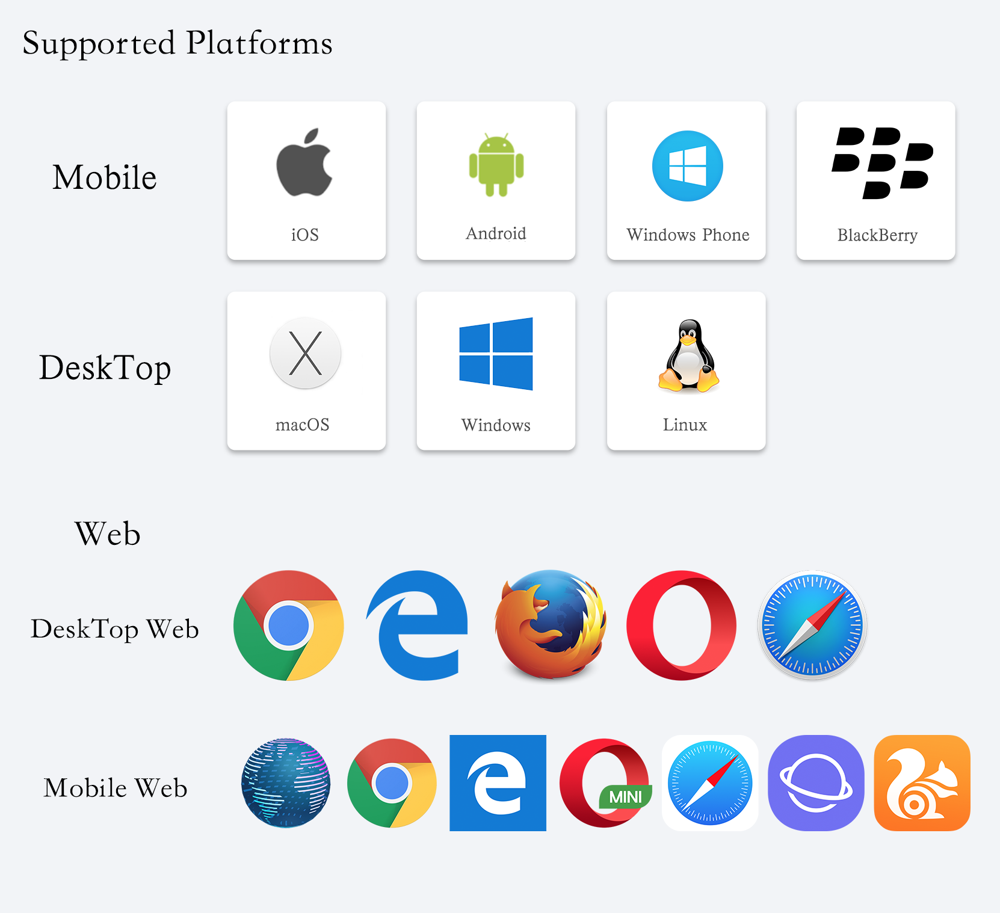
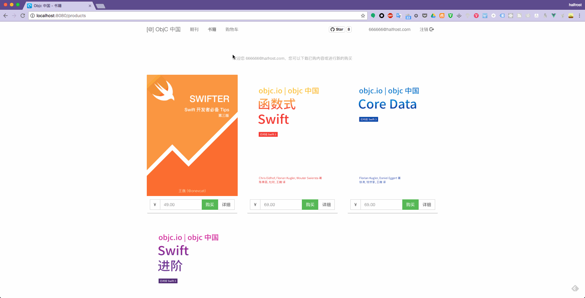

# Vue-ObjcCN

<p align='center'>

</p>

<p align="center">


</p>

Use Vue.js to develop a cross-platform full stack application of [Objc china](https://objccn.io/) 
 
   
- [x] ✅ Desktop applications, support Mac, Linux, Windows three platforms
- [x] ✅ Web applications, support for desktop browsers and mobile browsers
- [x] ✅ Mobile App, currently only supports the Cordova framework, support iOS、Android、Windows Phone、BlackBerry four platforms
- [ ] ❌ Mobile phone native App, intended to use Weex framework, the same support for both iOS and Android platform


<p align='center'>

</p>

> Note: This project is purely just for fun, please support [喵神(@onevcat)](https://github.com/onevcat)，support [Objc china](https://objccn.io/)。  


> [中文介绍 chinese introduction](./README_CN.md)

# Preface

## 一. About me

I am a full-time iOS developer, non-front-end developer. Due to contact with Weex development, thereby came into contact with the Vue.js.


## 二. Why write this project？


1. At the beginning of this idea is from a netizen, he asked me in my blog, the Internet has not a better Weex demo? I said that [@EVAN YOU](http://evanyou.me/)’s Hacker News is the best. Later netizen say, the bloggers can write one? I did not answer at the time. In fact, this thing I have always remember in my heart.

2. May 19 this year, GitHub use Electron rewrite the macOS and Windows client, coupled with the recent year development of cross-platform getting hotter, for some companies, the Web and app should be needed, app Also need iOS and Android two platforms, and even those who have to develop Weixin mini programs, desktop applications(despite a few), but with the same can be developed with the Electron. I also initiation of the idea of ​​want to be eager.

3. As a result of the contact to the Vue.js, of course, do not want to stay in the primary, would like to advanced, [@EVAN YOU](http://evanyou.me/) especially given the recommendations, is more practice, more practice. In order to speed up the pace of progress, I own private to find the project for practicing.

4. As for why to choose Objc China, the reason is actually very simple, because I am an iOS developer. In iOS developers, Objc is basically well known (do not know?), [喵神(@onevcat)](https://github.com/onevcat) is basically well known, I personally worship [喵神(@onevcat)](https://github.com/onevcat), so I chose Objc China to write.

5. Because of love ... ...


## 三. Why this development of cross-platform project without Weex？


After I finished the project, found that Vue code directly converted to Weex project, can not be achieved, a lot of error. And not all of them can be repaired immediately. I believe that I use the wrong way, not Weex's problem. By the way, Weex has released a new version, and then there is time to put Weeks version of the open source again.

Well, into the topic, Let's introduce this project:


# Technology stack & main framework

📦 All technology stack of Vue：vue2 + vuex + vue-router + webpack  
📌 ES6     
📡 Network request：axios  
🎈 Response framework：bootstrap，element-ui  
✏️ Backend：express  
📝 Code highlighted：highlight.js  
🗄 Database：lowdb  
📖 Markdown Parser：vue-markdown  
🔖 Form validation：vee-validate  
🏆 Cross-platform framework：Electron  

# 🔨 How to build 

Due to Objc china website is directly response html data, so I want to simulate the network request to return data, should build a server, write API return data.

I use Express framework to build a server, set up in the 8081 port, and write routing, the request will go to 8080, open the server will automatically open the background.

My current development environment is node v6.11.0 ，npm v3.10.10，Vue.js v2.8.2.


``` bash

# install dependencies 安装依赖
npm install

# serve with hot reload at localhost:8080
npm run dev

# serve with hot reload at localhost:8080
npm run start

# build for production with minification 打包
npm run build

# build for production and view the bundle analyzer report
npm run build --report

# run unit tests
npm run unit

# run e2e tests
npm run e2e

# run all tests
npm test

# 打包 Mac 应用
npm run build:mac

# 打包 Linux 应用
npm run build:linux

# 打包 Win 应用
npm run build:win

# 打包 Cordova 应用
npm run build:app

```


Here to talk about Cordova's packaging alone, it is slightly more than the desktop side of the special point.

First, make the src / main.js file on the three lines on the Coredova note open, Coredova library initialization needs to be included in the generation of Vue instance outside. After opening the comment, proceed to the next step.

I put a Makefile in the project, you can do this according to this.


1. First install the cordova command globally
> npm install -g cordova 

2. And then enter the following command to generate the app project directory
> cordova create app com.vueobjccn vueobjccn

3. Into the app folder
> cd app

4. Add the corresponding platform
> cordova platform add ios  
> cordova platform add android

5. Run the project
> cordova run ios  
> cordova run android


Cordova only generated a shell of the app, inside the specific content still read the webpage, in the corresponding application which has a www inside the folder, this folder is to load the page inside. JavaScript package will generate the www folder, just replace the content which inside the Cordova corresponding platform’s www folder.

Add a few words, app development to the present so mature era, if you develop a large app, with Cordova framework to do, do not use Objective-C or Swift to develop, do not do any optimization, the user experience is really not as good as the native fast. I have a special package to experience the Cordova app, did not do any optimization, packaged out on the experience, if it is critical of the user, on the current major app close to the perfect experience compared to really do not feel a little sense of satisfaction. If you really want to use front-end technology development app, to give 2 recommendations, if it is Cordova framework, we must try to optimize it, otherwise, the performance of app is not as good as the native performance. If you want to have a close to the native experience, then you can consider using React Native or Weex.


# 🚀 Cross-platform development

JavaScript cross-platform development packaged into desktop applications, mainly use the Electron framework. Here you need to install the devdependencies inside "electron", "electron-builder", "electron-packager" these three framework. Make sure the other path configuration in the webpack have configured completed.

About Cordova installation, I make complaints a little network problems in china. If you are not over the wall in china, it is really painful. For example, Not over the wall and in a very poor network environment, installation of Cordova globally, lots of error, even for the complete installation of cnpm after the addition of the iOS platform will later report a problem of 'co' file can not find, I suspect cnpm could not install the command complete. Later, I go back home, over the wall and network environment is very good, All of a sudden the npm installation is complete. But there is a small episode: If Cordova iOS 4.4.0 template throw a error, suggest installation of several times, the reason is still for the network over the wall in china, no catch to it.

There may be encountered the following error:

> "Error: Cannot find module 'config-chain'" when running 'ionic start'

The solution of this error is trying again the original order with the sudo command. This error could be solved

The final package will be done in the dist folder.

Next to show the performance of the cross-platform application on each platform:

First show the Web side:


<p align='center'>

</p>

<p align='center'>

</p>

<p align='center'>

</p>

<p align='center'>

</p>

<p align='center'>

</p>

And then show the effect in the mobile browser:

Android platform

Nexus 5x Web
<p align='center'>

</p>

Nexus 6P Web
<p align='center'>

</p>

iOS platform

iPhone 5 Web
<p align='center'>

</p>

iPhone 7 Web
<p align='center'>

</p>

iPhone 7 Plus Web
<p align='center'>

</p>

iPad Web

<p align='center'>

</p>

Then look at the performance in Mac side:

<p align='center'>

</p>

<p align='center'>

</p>

<p align='center'>

</p>

<p align='center'>

</p>

Finally look at Cordova's effect:

<p align='center'>

</p>

<p align='center'>

</p>

<p align='center'>

</p>

<p align='center'>

</p>

<p align='center'>

</p>

<p align='center'>

</p>

# 🌈 Function display

Build a Web page with Vue.js quickly.

<p align='center'>

</p>

Vuex management status is very convenient. Login status saved in the state inside, the global object will be obtained it.

<p align='center'>

</p>


Once the user is not logged in, click on the purchase of e-books, to determine no user login will jump to the login page.

Another point is to say that because this is a SPA, so the routing inside are using Router-link to achieve, but did not use `<a>` tag jump, the effect is to jump and do not have to request data, jump quickly. This user experience is really cool.

`<router-link>` is preferred over hard-coded `<a href="...">` for the following reasons:

It works the same way in both HTML5 history mode and hash mode, so if you ever decide to switch mode, or when the router falls back to hash mode in IE9, nothing needs to be changed.

In HTML5 history mode, router-link will intercept the click event so that the browser doesn't try to reload the page.

When you are using the base option in HTML5 history mode, you don't need to include it in to prop's URLs.

<p align='center'>

</p>

Log out of the page Similarly, once the user logs out, all show the user name will become a status to be logged in, the shopping cart on navigationBar also be disappeared. Manage status with Vuex, very Exciting.


<p align='center'>

</p>

This is the email form validation, not too much technical content.

<p align='center'>

</p>

Here is the shopping cart page, where the use of the MVVM page binding ideas, the page on the four buttons, any button will immediately change the following total price. iOSer learn that Vue.js on the MVVM implementation of thinking worthy.

Then this is the iPhone's Safari performance, the speed is well.

<p align='center'>

</p>

In the cross-platform of these applications, the best experience, I think it is the application of Mac. Use satisfaction is very high.


<p align='center'>

</p>


Finally Cordova framework build the mobile phone app, experience is unsatisfactory, in short, not optimized Cordova, for picky me, I was not satisfied. See this showcase below:


iPhone application

<p align='center'>

</p>

iPad application

<p align='center'>

</p>

# 🤔 After the completion of the project, I Fall into meditation


First Amway [element-ui](https://github.com/ElemeFE/element) this project, use it to build the project, really very fast, a app can be efficient development. the development of Vue.js students must have heard of this library. Saving a lot of time can put more energy on business development.

Everyone is saying that now is a large front-end era, mobile development and front-end integration is inevitable. But the development of the two platforms is still a lot of different, I experienced a front-end development and iOS development, thinking a lot, front-end and iOS are a lot of places to learn from each other, both have their own advantages and disadvantages. Then I intend to write a series of articles on these aspects. The engineering, component, routing, MVVM of front-end, respectively, and iOS where the advantages and disadvantages of each other, what can learn each other. (Feeling to dig a big pit)


# 📜 Feature

If I have free time, I want to support Weex, take Vue.js into a complete Weex application, become native app, the performance will not be bad. So cross-platform development should be the whole platform.


# ❗️ Errata

If found in the project what is puzzled or found a bug, welcome to submit PR or issue, thank you very much🙏🙏🙏

# ♥️ Thanks

If you like this project, welcome Star!

# 🌏 LICENSE


Vue-ObjcCN is available under the GPLv3 license. See the LICENSE file for more info.
